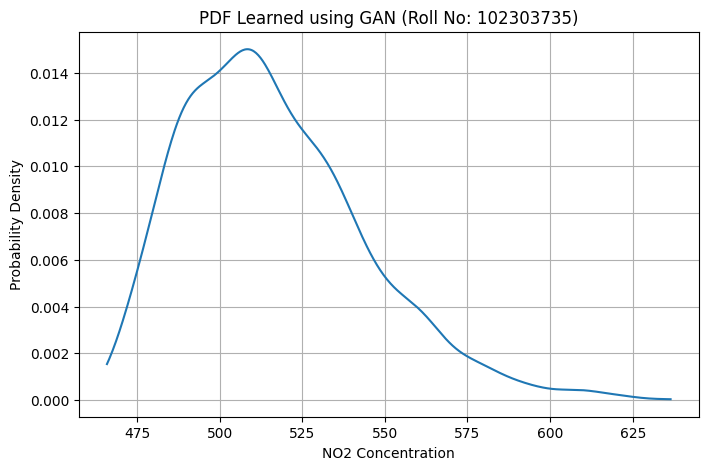

# VanshikaSaini_102303735_assignment2

##  objective
To train a GAN on NO₂ data and use the generated samples to estimate the probability density function (PDF).

Roll Number: 102303735

The data is transformed using:
- `a_r = 0.5 × (r mod 7)`
- `b_r = 0.3 × ((r mod 5) + 1)`

Resulting values:
- `a_r = 2.0`
- `b_r = 0.3`

Transformation applied:
x' = a_r × x + b_r

Where:
- `a_r = 2.0`
- `b_r = 0.3`

## approach i used 
1. Load the NO₂ data and clean it
2. Apply roll-number-based transformation
3. Normalize the data
4. Train a GAN with a generator and discriminator
5. Generate new samples from the trained model
6. Estimate the PDF using Kernel Density Estimation (KDE)

## Output
The final output is a smooth PDF curve representing the learned distribution of NO₂ data generated by the GAN.

## Tools Used
 Python
 PyTorch
 Pandas
 NumPy
 Scikit-learn
 SciPy
  Google Colab

## Conclusion
This assignment helped in understanding how GANs can be used to model data distributions and estimate probability density functions.

